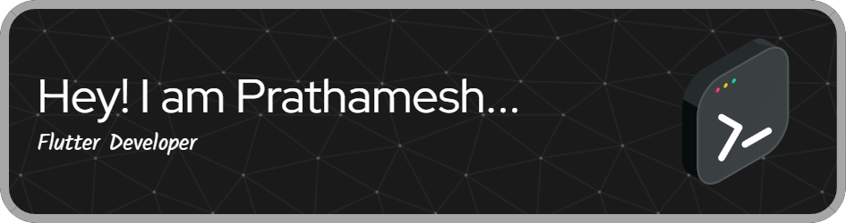

# 💫 About Me:
🔭 I’m currently working on Flutter 👯 I’m looking to collaborate on Flutter, Django and Mern 

# 💻 Tech Stack:

# 📊 GitHub Stats:

 

<!-- ### ✍️ Random Dev Quote -->
<!-- Proudly created with GPRM ( https://gprm.itsvg.in ) -->
